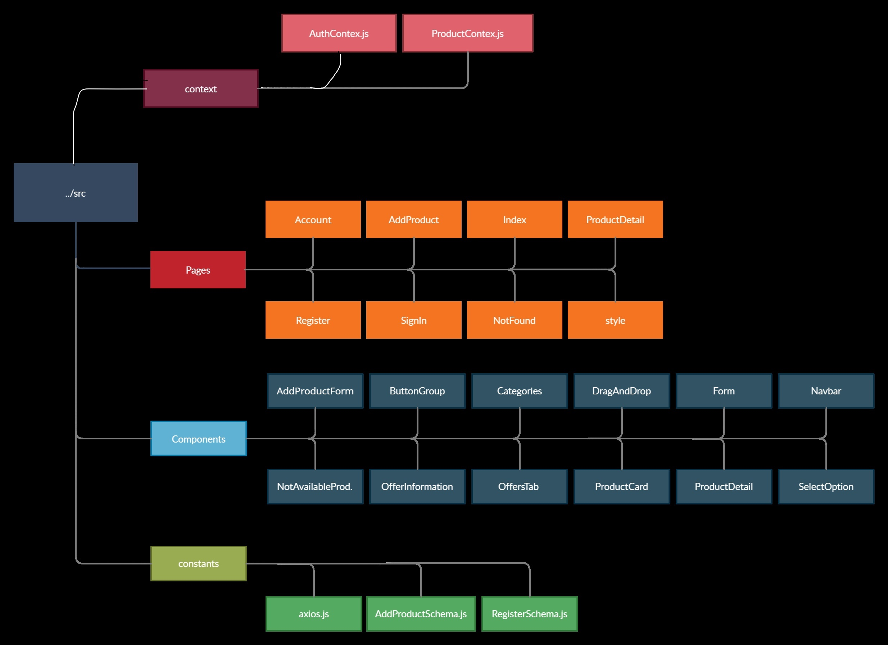
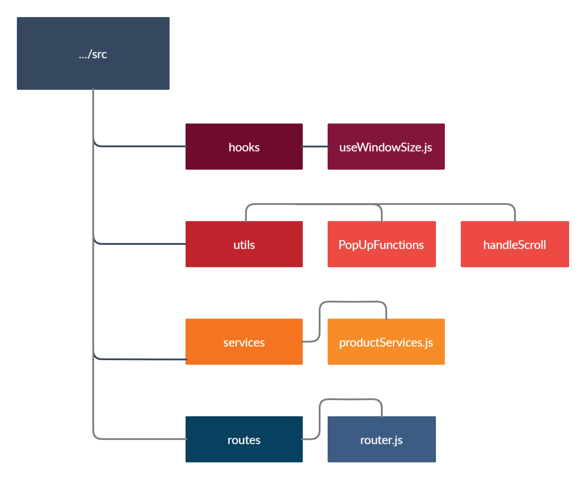

  

  

<h2 id="table-of-contents"> :book: İçerik</h2>

  
İçerik

  <ul>
    <li><a href="#ikinci-el-project"> Giriş</a></li>
    <li><a href="#demo-link"> Demo</a></li>
    <li><a href="#proje-hakkında"> Proje Hakkında</a></li>
    <li><a href="#özellikle"> Özellikler</a></li>
    <li><a href="#geliştirilecek-özellikler"> Geliştirilecek Özellikler </a></li>
    <li><a href="#dosya-mimarisi"> Dosya Mimarisi </a></li>
    <li><a href="#ikinci-el-project-kullanımı">Kullanım </a></li>
    <li><a href="#kullanılan-teknolojiler-ve-paketler">Teknolojiler </a></li>
    <li><a href="#contributing"> Contributing</a></li>
    <li><a href="#ben"> İletişim </a></li>    
  </ul>

# İkinci El Project
İkinci El Project isimli proje React.js kullanılarak yazılmış kullanıcıların kayıt olarak ürün satabildikleri, satışa çıkartılan ürünlere istedikleri fiyatta teklif verebildikleri ve ürünleri satın alabildikleri bir uygulamadır.

# Demo Link
Projenin demosuna [buradan ulaşabilirsiniz.](https://ikinciel-project-react.vercel.app/)

# Proje Hakkında

İkinci El Project uygulaması React.js ile [protein](https://protein.tech/) & [Patika](https://www.patika.dev/tr) React Bootcamp'inin bitirme projesi olarak geliştirilmiştir. Proje telefon, tablet ve full hd cihazlar ile uyumlu responsive tasarıma sahiptir. Proje, sahip oldukları ürünleri satmak isteyen ve 2. el ürün satın almak isteyen kişilerin kullanımı senaryosu üzerinden geliştirilmiştir.

# Özellikler
<strong>Uygulamada aşağıdaki işlemleri yapabilirsiniz:</strong>
- Kayıt olma ve kayıtlı kullanıcılar için giriş yapma,
- Bir ürünün tür, marka, renk vb. özelliklerini belirterek satışa sunma,
- Satışa sunulacak ürünü opsiyonel olarak teklife açık satışa sunma,
- Diğer kullanıcılar tarafından uygulamaya yüklenmiş ürünleri kategorilerine göre listeleme,
- Ürünün %20, %30 ve %40 fiyatına ve serbest fiyat değerinde ürüne teklif verme,
- Verilen teklifi geri çekme,
- Ürünü yükleyen kullanıcı tarafından belirlenmiş fiyat değerinde ürünü satın alma,
- Kullanıcının satışa sunmuş olduğu kendi ürünlerine gelen teklifleri onaylama veya reddetme,
- Kullanıcının diğer kullanıcı tarafından yüklenmiş ürününe vermiş olduğu teklif onaylandıysa satın alma.

# Geliştirilecek Özellikler 

<strong>Uygulama içerisinde geliştirilecek noktalar ve ilerleyen dönemlerde uygulamaya eklenecek özellikler:</strong>
- Kullanıcının kendi yüklemiş olduğu ürüne teklif vermesi engellenecek,
- Giriş yapmış kullanıcıların çıkış yapabilmesi sağlanacak,
- Uygulamaya birden fazla dil seçeneği eklenecek,
- Kullanıcılara koyu ve açık tema seçeneği sunulacak,
- Kullanıcıların yüklemiş oldukları ürünleri listeleme ve silme sayfaları geliştirilecek,

# Kurulum

1- Bir dosya oluşturun.  
2- Oluşturmuş olduğunuz dosyanın dizininde terminali açın.  
3- Terminale  `git clone https://github.com/enesergun/ikinciel-project-react.git` komutunu girin.  
4- Terminanele `cd ikinciel-project-react` komutunu girerek proje dizinine gidin.  
5- Editörü açın.  
6- Editörde terminale  `npm install` yazın.  
7- Terminale `npm start` komutunu yazarak projeyi çalıştırın.

# Dosya Mimarisi

  

  

# İkinci El Project Kullanımı

Uygulamada ürün ekleme, ürünlere teklif verme ve ürünü satın alma işlemlerinin yapılabilmesi için öncelikle authentication işleminin yapılmış olması gerekiyor. Bunun için ilk kez [İkinci El Project](https://ikinciel-project-react.vercel.app/)'e gelen kişi [adresinden](https://ikinciel-project-react.vercel.app/register) hesap oluşturmalıdır.  
Email ve parola bilgilerini uygun formatta giren kullanıcı kayıt oluşturur ve [index](https://ikinciel-project-react.vercel.app/index) sayfasına yönlendirilir. Kullanıcı ilgilendiği ürüne tıklayarak ürün detay sayfasına gider. (bkz: [ürün detay sayfası](https://ikinciel-project-react.vercel.app/productdetail/5)) Eğer ilgili ürün satılmışsa kullanıcı 'Bu ürün satışta değil' ibaresi ile karşılaşır; satılmamışsa ve ürünü yükleyen kullanıcı teklif opsiyonunu açmışsa kullanıcı 'Satın Al' ve 'Teklif Ver' butonları ile karşılaşır. Bu butonlar ile kullanıcı ürünü alabilir veya istediği teklifi verebilir.  

Kullanıcı login olmuşsa [Ürün ekleme sayfası](https://ikinciel-project-react.vercel.app/addproduct)ndan validasyon işlemini gerçekleştirerek ürünü ekleyebilir. Kullanıcı ürünün ismi, açıklaması, markası, kondisyonu, fiyatı ve fotoğrafından en az birini doldurmadığı taktirde hata ile karşılaşacaktır. Kulllanıcı login olmamışsa URL üzerinden ürün ekleme sayfasına erişmek istediğinde [giriş sayfası](https://ikinciel-project-react.vercel.app/login)na yönlendirilecektir. Benzer şekilde yalnızca login olmuş kullanıcıların erişebildiği [account](https://ikinciel-project-react.vercel.app/login) sayfasında yer alan 'Teklif Aldıklarım' sekmesinden teklif aldığı ürünleri ve 'Teklif Verdiklerim' sekmelesinden teklif verdiği ürünlere erişebilir. 

# Kullanılan Teknolojiler ve Paketler

Back end tarafında değerli hocamız [Oğuzhan Akbolat](https://github.com/oguzhanakbolat) tarafından [Strapi](https://strapi.io/) kullanılarak geliştirilen API kullanıldı. Front end tarafında validasyon işlemlerinde [react-formik](https://formik.org/) ve [yup](https://github.com/jquense/yup),route işlemlerinde [react-router-dom](https://reactrouter.com/), API'a istek gönderme işlemlerinde [axios](https://axios-http.com/), modal kullanımı için [react-modal](https://www.npmjs.com/package/react-modal), popup gösterimleri için [react-toastify](https://www.npmjs.com/package/react-toastify), ürün ekleme sayfasındaki select inputları için [react-select](https://react-select.com/home) ve selectlerin custom styleları için [glamor](https://www.npmjs.com/package/glamor) ve ürünün fotoğrafını yüklemek için [react-images-uploading](https://www.npmjs.com/package/react-images-uploading) kullanıldı.

# 🤝 Contributing

İkinci El Project benim React.js ile geliştirmiş olduğum en kapsamlı proje olmakla beraber React.js'te öğrenmiş olduğum birçok yeni yapıyı bu projede deneyimleme imkanı buldum. Dolayısıyla bu projedeki eksikliklerimi gidermede ve projeyi iyileştirmede tavsiyelere açığım. Bugları birlikte [çözelim](https://github.com/enesergun/ikinciel-project-react/issues)

# Ben
  🤓 Enes Ergün

  -Linkedin [Enes Ergün](https://www.linkedin.com/in/enesergun/)
  -Twitter [@ergunenes_](https://twitter.com/ergunenes_)
  -Medium [@enesergun](https://medium.com/@enesergun)

# License

 [MIT](https://choosealicense.com/licenses/mit/)